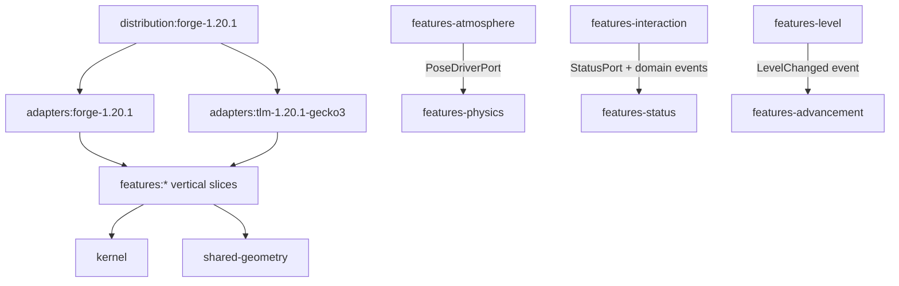

# 特性优先多版本架构革新

## 架构原则
- **顶层按特性划分，特性内部再分层**：保留 Level、Status、Advancement、Interaction、Physics、Shading、Atmosphere 七个独立领域住处；禁止建立全局 `domain/`、`service/`、`adapter/` 大平层。
- **依赖指向稳定核心**：特性核心只依赖 `kernel`、共享数学库和其他特性的公开 API；Forge、Minecraft、TLM、Gecko、Mixin 只能位于外层适配模块。
- **端口由使用方拥有**：跨特性调用通过窄 API、Port 或领域事件；移除 `*Feature.INSTANCE`、`MaidCriteria` 枢纽式直连和 `platform` 反向引用 feature DTO。
- **热路径不教条化**：物理内部采用引擎门面和显式状态所有权，保留预分配与零分配，不在逐帧路径引入通用事件总线或多层对象包装。
- **破坏性重组**：直接迁移包名和 API 并修复全部调用方，不建立 `@Deprecated` 转发层；提交前必须恢复完整构建、验证和性能基线。

## 目标工程结构

建议 Gradle 子工程：
- `kernel/`：纯 Java 特性契约、领域事件发布接口、通用结果类型；替代当前带 Forge `IEventBus` 的 [`FeatureContext`](src/main/java/com/laixia/maidintelligence/core/feature/FeatureContext.java)。
- `shared/geometry/`：仅放 physics、interaction、shading 真正共用的骨骼/网格数学，不承载业务规则。
- `features/{level,status,advancement,interaction,physics,shading,atmosphere}/`：每个特性内部拥有 `api/`、`domain/`、`application/`、`port/`；外部只能引用 `api`/`port`。
- `adapters/forge-1.20.1/`：事件、命令、网络、GUI、资源重载、Codec/MC 类型转换。
- `adapters/tlm-1.20.1-gecko3/`：`EntityMaid` 存储、TaskData/Brain、Gecko/Bedrock 模型桥、TLM 扩展和全部 TLM/Gecko Mixin。
- `distribution/forge-1.20.1/`：`@Mod` 组合根、版本资源、`mods.toml`、Mixin 配置和最终 Jar；未来版本只新增对应 adapters/distribution。

## 实施步骤

### 1. 固化迁移基线与构建护栏
- 盘点并统一注册现有 81 个验证入口；让根 `check` 覆盖 Level、Status、Advancement、Face、Shading、Physics 以及目前遗漏的碰撞验证。
- 保存 `verifyBonePhysics`、全模型 `MeshPenetrationAudit`、关键 benchmark 和当前 Jar 资源清单，作为破坏性迁移后的等价基线。
- 在架构验证中禁止 `features/*` 核心 import `net.minecraft`、`net.minecraftforge`、TLM `com.github.tartaricacid` 或 Gecko 类型。

### 2. 重建 Gradle 多工程骨架
- 将当前 [`settings.gradle`](settings.gradle) 和 [`build.gradle`](build.gradle) 改为根聚合构建，引入 version catalog/convention build logic，集中管理 Java、MC、Forge、TLM、Mixin 版本矩阵。
- 先建立 `kernel`、七个 feature、两个 1.20.1 adapter 与一个 distribution；最终仍输出单一 Forge Mod Jar。
- 将 ForgeGradle、runClient、reobf、Mixin refmap 和资源处理全部限制在 1.20.1 adapter/distribution，纯 feature 使用普通 Java 插件并可独立测试。

### 3. 建立特性契约与组合根
- 重写 [`FeatureCatalog`](src/main/java/com/laixia/maidintelligence/core/feature/FeatureCatalog.java)：从静态 singleton 列表改为 distribution 侧显式装配，特性核心不持有 Forge EventBus。
- 每个 feature 暴露唯一 API/Port；packet DTO、持久化模型、领域事件归所属 feature，网络编解码器归 Forge adapter。
- 将升级、喂食、状态变化等跨域行为改为类型化领域事件，解除 Advancement↔Level、Interaction→Status/Advancement 的直连环。

### 4. 迁移六个常规特性垂直切片
- 依次迁移 `level`、`status`、`advancement`、`interaction`、`shading`、`atmosphere`，保持每个特性自己的 `api/domain/application/port` 结构。
- 把各 feature 的 `event/client/tlm/network` 代码分别落入 Forge 或 TLM adapter，但仍按 feature 子目录组织，避免适配层再次平铺。
- 抽取 interaction/physics/shading 重复的模型几何读取为 `shared-geometry` Port；Gecko、Bedrock、YSM 实现留在 TLM adapter。

### 5. 重构 Physics 为单一高内聚特性
- 在 `features/physics/` 内建立 `api/`、`metadata/`、`discovery/`、`geometry/`、`layout/`、`engine/spring/`、`engine/collision/{model,bake,runtime}/`、`session/`、`diagnostics/`，不把 physics 拆散到全局技术层。
- 从 [`MaidBonePhysics`](src/main/java/com/laixia/maidintelligence/feature/physics/client/MaidBonePhysics.java) 抽出实体会话与帧编排；Gecko 动画读取/写回变为 `BoneModelPort`/`PoseWriterPort`。
- 将 `RuntimeCollisionFrames` 归 collision runtime，打断 spring↔collision 双向依赖；spring 只依赖碰撞窄接口。
- 拆分 [`PhysicsSolverLayout`](src/main/java/com/laixia/maidintelligence/feature/physics/client/solver/PhysicsSolverLayout.java)、[`PreparedCollisionProxySet`](src/main/java/com/laixia/maidintelligence/feature/physics/client/solver/collision/runtime/PreparedCollisionProxySet.java) 等 hub：选择、投影、接触所有权、空间剔除分别拥有状态；`SpringBoneState` 仍采用预分配数组但按积分/接触/振荡职责封装。
- 把“一个物理体的当前碰撞所有权”建模为显式 `ContactOwnerState`，由 collision runtime 独占维护，阻尼只消费结果，不再反向操纵代理黑名单。

### 6. 收敛版本敏感适配器
- 将 [`LittleMaidCompat`](src/main/java/com/laixia/maidintelligence/compat/LittleMaidCompat.java)、各 feature 的 `tlm` 代码与 12 个 Mixin 迁入 TLM/Forge adapter；Mixin 仅提取参数并调用稳定 Port。
- 将 [`ModNetwork`](src/main/java/com/laixia/maidintelligence/platform/network/ModNetwork.java) 降为 Forge adapter 的通道实现；packet 注册由各 feature adapter 提供，不允许基础设施 import 领域实现。
- 按 `common mixins / client mixins / tlm-gecko3 mixins` 分配置与 refmap，为未来 TLM/Gecko 方法签名变化提供独立替换点。

### 7. 建立版本矩阵扩展方式
- 在构建文档中规定：新增版本只添加 `adapters/forge-<mc>`、`adapters/tlm-<mc>-<gecko>`、`distribution/forge-<mc>`，七个 feature 与 kernel 不复制。
- 将 Minecraft/TLM 类型转换、资源格式差异、网络注册、Java toolchain、Mixin 描述符全部封装在版本模块。
- 预留 NeoForge Port 但本轮不创建 NeoForge/Fabric 实现，符合当前仅支持多 Forge 版本的目标。

### 8. 全量收口验证
- 修复全部生产与测试 import，删除旧单模块目录和失效 singleton/兼容门面，确保不存在重复实现。
- 运行所有纯 JVM 验证、Forge 编译、GameTest 可编译性、全模型物理审计、性能/零分配基准和 runClient 冒烟。
- 更新根架构文档与每个 feature 的边界说明，记录允许的依赖方向、公开 API、版本适配步骤和性能约束。
