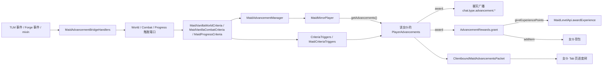

# 女仆原版进度系统

本文档说明「TLM：朝夕相伴」怎么让女仆拥有和玩家对等的**原版进度（advancement）**：
镜像玩家如何工作、女仆行为怎么喂进原版触发器、进度存在哪、界面怎么画，以及附属模组怎么扩展。

## 1. 分析基准

- Minecraft：1.20.1
- Forge：47.4.0
- 车万女仆：1.5.3 Forge
- 稳定功能模块：`features/advancement/src/main/java/com/laixia/maidintelligence/feature/advancement`
- Forge 适配器：`adapters/forge-1.20.1/src/main/java/com/laixia/maidintelligence/feature/advancement`
- TLM/Gecko 适配器：`adapters/tlm-1.20.1-gecko3/src/main/java/com/laixia/maidintelligence/feature/advancement`
- 内置进度数据：`distribution/forge-1.20.1/src/main/resources/data/tlm_companionship/advancements/maid`

## 2. 为什么是镜像玩家

原版所有触发器只接受 `ServerPlayer`，并且按 `player.getAdvancements()` 找监听者
（见 `SimpleCriterionTrigger#trigger`）。要做到「玩家有什么女仆就有什么」，
只能让原版自己去分发，而不是给四十多种触发器逐个写适配。

- **镜像玩家**（`MaidMirrorPlayer`）：每个维度一个 `ServerPlayer` 子类，不入世界、不进玩家列表、不 tick。
  调用触发器前把「当前女仆」的位置、朝向、血量、着火与冰冻计时、药水效果、姿态与全部物品同步进去。
- **不能继承 Forge 的 `FakePlayer`**：Forge 在 `PlayerAdvancements#award` 开头对假玩家直接返回 false，
  会静默吞掉全部进度。所以直接继承 `ServerPlayer`，并把 `FakePlayer` 里防崩溃的重写抄了一份。
- **每只女仆一份真实的 `PlayerAdvancements`**，由本模组自己创建与释放，不经 `PlayerList` 缓存。



聊天提示与经验都不用自己写：`award` 里原版会用 `player.getDisplayName()` 广播并尊重
`announceAdvancements` 游戏规则，`AdvancementRewards#grant` 会调 `giveExperiencePoints` /
`addItem` / `awardRecipesByKey`。前两个重写成转发给女仆（经验来源为 `ExperienceSource.ADVANCEMENT`），
最后一个必须是空实现——它会碰 `connection`，而镜像玩家没有连接。

`MaidAdvancementManager#fire` 还带一个递归深度上限：奖励发经验可能引出升级，升级又可能触发进度，
四层之后直接丢弃。

## 3. 进度存哪

```text
<存档>/tlm_companionship/maid_advancements/<女仆UUID>.json
```

直接用原版 `PlayerAdvancements` 的读写，格式与玩家进度完全一致。

之所以不存进 TLM TaskData：原版 `load()` 会跳过已完成条目的监听注册，
而手工恢复会让已完成的 criteria 重新触发 `award`，导致每次重登都重播一遍聊天广播和经验奖励。
代价是进度不随女仆物品跨存档迁移；同一存档内女仆 UUID 不变，正常收纳、放置、跨维度都不受影响。

| 时机 | 行为 |
| --- | --- |
| 女仆首次需要进度 | 懒创建 tracker，并在首次创建时静默迁移旧成就（见第 6 节） |
| 女仆离开世界 | `stopListening()` + 落盘后释放 |
| 世界保存 / 服务器停止 | 落盘所有脏 tracker |
| `/reload` | 对所有 tracker 调 `reload`，对齐原版对在线玩家的处理 |

只有**有主人**的女仆才会建立进度；无主女仆不占内存也不写文件。

## 4. 桥接表

统一挂在 `event/MaidAdvancementBridgeHandlers`，只有实在没有事件的才用 mixin。

| 触发器 | 来源 |
| --- | --- |
| `inventory_changed` | `MaidPickupEvent.ItemResultPost`、`MaidEquipEvent`、`MaidBackpackChangeEvent`、`MaidBaubleChangeEvent`，外加 20 tick 指纹对账 |
| `location` | `MaidTickEvent`，每 20 tick 一次（与原版对玩家的节流一致） |
| `player_killed_entity` / `entity_killed_player` | `LivingDeathEvent` |
| `player_hurt_entity` / `entity_hurt_player` | `LivingHurtEvent`（记减伤前伤害）+ `LivingDamageEvent` |
| `effects_changed` | `MobEffectEvent.Added/Remove/Expired`，外加指纹对账 |
| `consume_item` | `LivingEntityUseItemEvent.Finish`、`MaidAfterEatEvent` |
| `using_item` | `LivingEntityUseItemEvent.Tick`，每 5 tick 一次 |
| `changed_dimension` / `nether_travel` | `EntityTravelToDimensionEvent`，进下界的位置记在 `MaidBridgeMemory` |
| `fishing_rod_hooked` | `MaidFishedEvent` |
| `fall_from_height` | `LivingFallEvent`，按落点与落差还原起跳点 |
| `item_durability_changed` | 20 tick 对账手持工具的损伤值 |
| `enter_block` | 20 tick 对账脚下与视线两格，方块没换不重复上报 |
| `recipe_crafted` | `PlayerEvent.ItemCraftedEvent`，且容器是这只女仆的工作台背包 |
| `bred_animals` | mixin 记下女仆撮合过的动物 + `BabyEntitySpawnEvent` 认领 |
| `placed_block` / `item_used_on_block` | mixin `EntityMaid#placeItemBlock` |
| `honey_block_slide` | mixin `HoneyBlock#maybeDoSlideAchievement` |
| `maid_fed`、`maid_level`、`maid_favorability_level`、`maid_experience` | 本模组自定义，见第 5 节 |

三处 mixin 按目标边界拆分：`HoneyBlockSlideMixin` 注册在
`distribution/forge-1.20.1/src/main/resources/tlm_companionship.common.mixins.json`，
另外两处 TLM mixin 注册在
`distribution/forge-1.20.1/src/main/resources/tlm_companionship.tlm-gecko3.mixins.json`：

| mixin | 为什么非要 mixin |
| --- | --- |
| `EntityMaidPlaceBlockMixin` | 女仆放方块直接调 `BlockItem#place`，Forge 的放置事件只从 `ItemStack#useOn` 进来，根本不发。三个重载都汇到四参数那个，只挂它 |
| `MaidFeedAnimalTaskMixin` | TLM 调 `setInLove(null)`，原版不会把繁殖记到任何人名下 |
| `HoneyBlockSlideMixin` | 下滑的判定条件全在方块里，原版只在最后一步把非玩家挡掉 |

**没有桥接的**：睡床、附魔、酿造、图腾、信标、引雷、骑猪灵下岩浆、村民交易等等。
这些是女仆物理上做不到的事（TLM 也没有交易任务），会像「一个从不睡觉的玩家」那样自然停在未完成，
是行为决定的，不是能力缺口。

`MaidBridgeMemory` 存桥接需要的瞬时状态（各类指纹、进下界的位置、撮合过的动物），
这些都不入档，女仆卸载或服务器停止时丢掉。

### 4.1 排除在外的进度

`domain/MaidAdvancementScope` 是唯一一份「哪条进度算女仆的」判断，服务端与客户端共用。
目前只排掉一整个命名空间：**车万女仆本体的 `touhou_little_maid`**。那套进度讲的是玩家怎么和女仆
相处（召唤女仆、驯服女仆、给女仆拍照、拿走女仆的经验），女仆自己去完成毫无意义；
而其中几条恰好用的是原版判定，桥接会真的判给女仆：

| 本体进度 | 判定 | 不排除会怎样 |
| --- | --- | --- |
| `base/craft_gohei`、`base/craft_chair` | `recipe_crafted` | 玩家借女仆的工作台背包做御币，女仆白拿 50 点经验并广播一条进度 |
| `base/kill_maid_fairy` | `player_killed_entity` | 女仆打死女仆妖精就算玩家的进度做完了 |
| `give_smart_slab`、`grant_book_on_first_join` | 本体的配置触发器 | 这两条的奖励是直接发书与发智能音符盒，判给女仆等于凭空多物品 |

排除是三处一起生效的：

| 位置 | 做法 |
| --- | --- |
| 授予 | `MaidAdvancementTracker.ScopedAdvancements` 覆写 `PlayerAdvancements#award`，不在范围内直接返回 `false`，于是进度不记、奖励不发、聊天不广播 |
| 下发 | `snapshot` 整棵根进度跳过，老存档里已经判给女仆的记录也就不会再显示 |
| 界面 | `MaidAdvancementTree` 整棵树不建，图标条里连页签都不出现 |

覆写 `award` 有个坑要留意：原版构造函数里的自动触发检查会调它，那时候子类字段还没初始化，
所以判断只能用静态状态。要排除别的模组，往 `EXCLUDED_NAMESPACES` 里加命名空间即可。

## 5. 自定义触发器

四个触发器在 `FMLCommonSetupEvent.enqueueWork` 里注册，**必须注册**，
否则数据包里引用它们的进度会解析失败。

| 触发器 ID | 条件字段 | 判定依据 |
| --- | --- | --- |
| `tlm_companionship:maid_fed` | `item`（`ItemPredicate`）、`count`（`MinMaxBounds.Ints`） | 累计喂食次数，写了 `item` 就只数匹配的那些 |
| `tlm_companionship:maid_level` | `level` | 女仆当前等级 |
| `tlm_companionship:maid_favorability_level` | `level` | 女仆当前好感等级（0–3） |
| `tlm_companionship:maid_experience` | `experience` | 累计获得的等级经验 |

计数类阈值（例如喂 8 次蛋糕）不能靠 criteria 表达，所以改为**按女仆统计量**判定：
`MaidStatistics` 走 TLM TaskData `tlm_companionship:maid_statistics` 随实体存档，
触发器的 `matches` 拿统计量比阈值。这也意味着阈值类进度会随女仆实体跨存档迁移，
而完成状态本身留在存档文件里。

等级、好感等级与经验这三条每 20 tick 会重放一次（`MaidProgressCriteria#replaceStanding`），
所以系统上线前就已经是高等级的女仆不需要再升一级才补上，根进度 `maid/root` 也挂在等级触发器上，
同时兼作「我是一只女仆」的判定。

## 6. 旧成就迁移

旧的独立成就系统已删除，11 条成就一对一变成真正的进度，放在 `advancements/maid/` 下，
标题与描述沿用原来的 `achievement.tlm_companionship.*` 语言键。

迁移在**首次为这只女仆建立进度文件时**执行一次：读旧 TaskData
`tlm_companionship:achievement_progress`，把已解锁的 ID 静默补齐（直接写 `grantProgress`，
不走 `award`，所以不会补发广播与奖励），把旧计数抬进 `MaidStatistics`，最后清空旧 TaskData。

| 旧成就 ID | 新进度 ID |
| --- | --- |
| `first_feed`、`regular_meals`、`sweet_tooth` | `tlm_companionship:maid/first_feed` 等同名条目 |
| `apprentice`、`veteran`、`paragon`、`perfect_maid` | 同名，挂在等级链上 |
| `diligent_study` | 同名，挂累计经验 |
| `acquainted`、`trusted`、`devoted` | 同名，挂好感等级 |

`maid/root` 是新加的根进度，作为女仆自己的 tab。

## 7. 界面

进度页是女仆界面的一个 Tab 页，不是浮在上面的独立窗口：`MaidAdvancementContainer` 继承本体
`AbstractMaidContainer`，`MaidAdvancementPageScreen` 继承 `AbstractMaidContainerGui`，
所以左侧状态区、顶部 Tab 条、任务列表与底部开关都由本体绘制，本模组只画右侧内容区。

内容区是本体主贴图在 `(80,28)` 预留的空面板，去掉边框后是 `(84,32)` 起的 168×129：

| 行 | 高度 | 内容 |
| --- | --- | --- |
| 表头 | 10 | 左侧根进度标题（超长裁剪），右侧「已完成 / 总数」 |
| 图标条 | 17 | 一页 8 个根进度图标，两侧各 10 像素翻页箭头 |
| 树视图 | 102 | 可拖动平移、可滚轮上下滚的进度树 |

图标条里女仆专属的那棵排最前（这本来就是女仆自己的页面），然后是原版，最后是其它模组。
女仆根进度的条件是等级 ≥ 1，每只女仆天生成立，所以一进世界这一格就是点亮的，
它的下一级（好感度那条链的「初识」等）也跟着露出来，页面不会是空的。

原版的 tab 条要 252 像素，这里只有 168，所以换成「左右箭头 + 翻页」；
换算全在 `AdvancementStripLayout` 与 `AdvancementTreeLayout` 两个纯数值类里，可以单独验证。
控件本身照搬原版画法（背景平铺、连线、26×26 边框、`blitNineSliced` 悬浮框），封装在 `AdvancementStyle`。

### 7.1 数据流：为什么条目定义也得自己送

开页时客户端发 `ServerboundRequestMaidAdvancementsPacket`，服务端回
`ClientboundMaidAdvancementsPacket`；页面开着时进度一动就重发一份。

**不能借玩家客户端本来那份进度表**（`minecraft.player.connection.getAdvancements()`）。
那份不是完整的进度表，而是服务端**按玩家可见性**下发的子集：原版只把「自己或两级以内的祖先
已完成」的条目发给客户端（`AdvancementVisibilityEvaluator`，所以新号打开原版进度界面是空的）。
女仆专属的那几条玩家永远不会完成，于是客户端压根不知道它们存在——我们那一整栏在图标条里都不会
出现；女仆在别的树里做到的地方，也常常还没对玩家开放。

所以服务端按**女仆自己的**进度算一遍同一套可见性（`MaidAdvancementTracker.snapshot`），
把可见条目的定义连同完成情况一起送，客户端存进自己那份 `AdvancementList`
（`ClientMaidAdvancements`），与玩家的互不干扰。载荷直接借原版
`ClientboundUpdateAdvancementsPacket` 编解码，格式与原版发给玩家的一模一样。
可见集一定包含每个可见条目的所有祖先（父节点的可见性由子节点决定），客户端才解析得出父子关系。

每次推送都是整份替换：完成一条会连带露出它周围原本不可见的条目，只补那一条不够。
界面因此在版本号变化时整棵树重建，只把平移位置从旧树接过来。
条目的坐标是服务端 `TreeNodePosition` 算好写进 `DisplayInfo` 的，跟着定义一起过来，客户端不用再排版。

还有个坑：`AdvancementProgress` 的线上格式只带每条 criterion 的状态，**不带完成条件本身**
（那个 `String[][] requirements`），而 `isDone`、`getPercent`、`getProgressText` 全靠它，
补齐之前完成的条目会被当成未完成——界面上就是边框不高亮、表头完成数恒为 0。
所以 `ClientMaidAdvancements.accept` 收包后要照原版 `ClientAdvancements` 的做法，
用刚收到的定义把 `update(criteria, requirements)` 补回去。这一步也是包处理必须
`enqueueWork` 回主线程的原因：要解析父子关系，表本身又归渲染线程读。

Tab 按钮的槽位避让沿用成就页那套两步定位（`Init` 里挑空位、`Render.Pre` 复核），
详见[界面分析手册](../MAID_GUI_ANALYSIS.md) 15.6 节。

## 8. 附属模组扩展

不再需要注册什么，**直接发 advancement JSON 就行**：女仆读的是和玩家同一份进度表，
所以任何模组的进度女仆都能拿（除了 4.1 节排除掉的命名空间）。
想做女仆专属的，把上面四个自定义触发器写进 `criteria` 即可：

```json
{
  "parent": "tlm_companionship:maid/root",
  "display": {
    "icon": { "item": "minecraft:cake" },
    "title": { "translate": "advancement.my_mod.cake_lover.title" },
    "description": { "translate": "advancement.my_mod.cake_lover.description" },
    "frame": "goal"
  },
  "criteria": {
    "fed_cake": {
      "trigger": "tlm_companionship:maid_fed",
      "conditions": {
        "item": { "items": ["minecraft:cake"] },
        "count": { "min": 8 }
      }
    }
  },
  "rewards": { "experience": 20 }
}
```

两个注意点：

- `criteria` 里的 `player` 谓词是拿**镜像玩家**判定的（原版 `SimpleCriterionTrigger` 固定用
  `createContext(player, player)`），所以镜像的状态同步完整度直接决定判定准确度；
  NBT 类谓词按玩家实体判定，注定不匹配。
- 奖励里的配方（`recipes`）对女仆是空操作，经验与物品会落在女仆身上。

## 9. 已知取舍

- 每只女仆的 `PlayerAdvancements` 会为全部进度（含约 1100 条配方进度）注册监听，
  内存开销约等于多一个在线玩家。对策是懒创建加卸载即释放。
- 镜像玩家不是 `FakePlayer`，别的模组若靠 `instanceof FakePlayer` 过滤假玩家将不会过滤它。
  缓解方式是镜像玩家只在触发器调用期间同步存在，不入世界、不进玩家列表、不 tick。
- 定时对账是按实体错开相位的（`tickCount + entityId` 取模），几十只女仆不会挤在同一 tick 全量扫描。

## 10. 验证

| 命令 | 覆盖内容 |
| --- | --- |
| `gradlew verifyAdvancementDomain` | `MaidStatistics` codec 与累计、旧数据抬升、内置进度 JSON 的父子链与触发器与两份语言文件、内置进度都在女仆范围内而本体命名空间不在、进度网络包字节流往返（含「补回 requirements 才算完成」这一步）、图标条翻页与树视图平移换算 |
| `gradlew check` | 包含上面这条 |
| `gradlew runGameTestServer` | 女仆背包塞工作台后拿到 `minecraft:story/root`、根进度来自女仆自己的等级且新女仆一开始就可见（连带露出下一级）、统计量驱动阈值进度、进度跨卸载重载往返、奖励经验落在女仆身上且只结算一次、本体的「制作御币」既不同步也不给女仆经验 |

网络协议版本已提升到 `13`，客户端与服务端必须同时更新。
