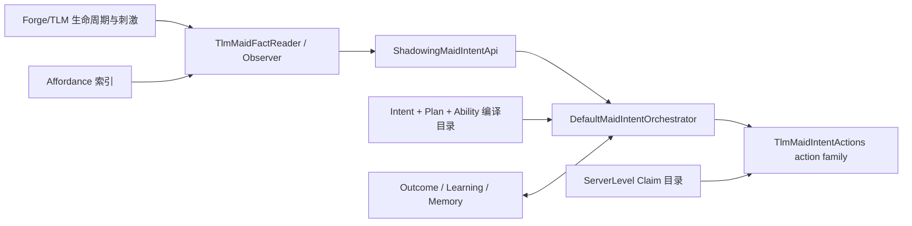
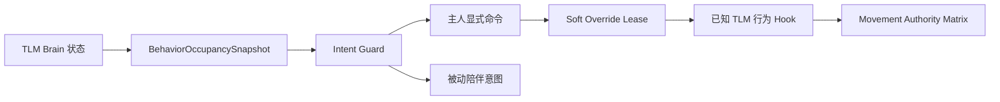

# 陪伴智能维护契约

本文面向维护者与代码 Agent，规定陪伴智能的唯一所有者、接线位置、生命周期和不可破坏的
不变量。玩家可见行为参见[陪伴行为说明](../maid-behaviors/companion/README.md)，Data Pack
字段参见[意图 AI 格式](intent-ai-data.md)。

## 单一决策与执行核心

陪伴智能不得建立第二套顶层 AI。所有候选选择、承诺/滞回、中断、计划状态推进和终态记录
都必须经过 `DefaultMaidIntentOrchestrator`：



- `:features:ai:orchestration` 独占 Utility、Plan、恢复、Outcome 和资源 Claim 的平台中立语义。
- `:features:ai:behavior` 提供陪伴领域词表、Affordance、Ability、Learning 和主人群组协调。
- Forge adapter 只负责配置、命令、资源重载和事件注册。
- TLM adapter 只读取实体事实、实现动作副作用、TaskData 持久化及世界生命周期转换。
- `distribution/forge-1.20.1/MaidIntelligence` 只做组合；禁止把领域判断搬回组合根。
- `MovementIntentLease` 只协调单女仆 Brain 移动写入，不得代替跨女仆 Claim。

## 原版/TLM 行为占用仲裁

陪伴侧不得接管 TLM `Activity` 或清理未知 addon 的硬行为状态。统一通过
`BehaviorOccupancySnapshot` 与移动权威矩阵决策：



占用分级：

- `HARD`（code 2）：呼吸、战斗/Panic、Home、内置工作/棋类、拾取承诺、偷吃、使用物品、
  睡眠、拴绳、命令坐下，以及未知 writer 的 fail-open。任何陪伴意图退让。
- `SOFT`（code 1）：IDLE 娱乐、随机游走、Beg、普通/载具跟随、普通被动座位。
- `IDLE`（code 0）：无原版占用。

移动权威（先于 Brain priority）：
`EMERGENCY > NATIVE_COMMITMENT > OWNER_COMMAND > NATIVE_SOFT / PASSIVE_COMPANION`。

事实与生命周期：

- `TlmBehaviorOccupancyClassifier` 每 tick 在 `TlmMaidFactReader` 中只计算一次快照，并编码
  `behavior_occupancy_level` / `behavior_occupancy_reason`；旧 `movement_hard_blocked` 由
  `HARD` 派生以保持兼容。
- 注视计划 `gaze_recall_session` 的 `approach_owner` 动作使用 `authority=owner_command`：
  可干净抢占 `SOFT`，续租贯穿
  approach 与指挥窗口；失败、取消、quiesce、halt、战斗或超时必须释放 override。
- 归队、饥饿反馈、零食柜与 Ability 模板默认要求 `IDLE`；未实现软抢占生命周期的能力不得
  越过 `IDLE`。
- Shadow 只预测同一仲裁结果，不得取得 override、离座或写 Brain。

扩展已知 TLM 行为时必须同时补齐：

1. `TlmBehaviorOccupancyClassifier` 的 reason/level。
2. 对应 mixin hook（登记 lease，并在 owner-command override 期间让路或拒绝启动）。
3. `tlm_companionship.tlm-gecko3.mixins.json` 注册。
4. JVM/GameTest：SOFT 可被注视抢占，HARD/未知 writer 保持 fail-open。

当前已覆盖的主要 hook：Joy、BoardGame、RunOne 随机游走、Follow/Beg、载具跟随、
BlockJoy 上座兜底（仅 IDLE 娱乐）、Breath/Home/Pickup/偷吃/工作目标既有协调。

## 生产接线

### 启动与组合

1. `MaidIntelligence` 创建 `MutableIntentCatalog`、`MutableAbilityCatalog`。
2. `TlmBehaviorComposition.create` 创建唯一共享的感知服务、能力服务、学习服务、live
   orchestrator 和 dry-run orchestrator。
3. `ShadowingMaidIntentApi` 包装两侧；`SHADOW_COMPARE` 时始终先推进 shadow，再推进 live，
   保证两侧读取同一 tick 的副作用前状态。
4. `BehaviorTlmModule` 注册 `CompanionTaskData`，并通过 `BehaviorExtraBrain` 把
   `MaidIntentBehavior` 安装为 TLM Core Behavior。
5. `BehaviorForgeInstaller` 注册玩家 tick、区块、方块、实体和 Level 生命周期事件。

任何新服务如果未从上述链路可达，就不是已交付功能。不得以“类存在、可编译或纯 JVM
验证通过”代替组合根接线。

### Tick 顺序

单只女仆的正常 tick 顺序固定为：

1. `TlmMaidIntentObserver` 采集工作释放、随机游走等边沿。
2. 能力自主适配器只在满足滞回需求时产生有期限 Request。
3. shadow 在启用时先只读评估。
4. live 读取事实、选择候选并推进一个计划步骤。
5. live 动作可以写 Brain、实体、物品和 Claim；shadow 永远不可以。

不要在事实读取期间写入 Brain、扣物品、申请 Claim 或强制加载区块，否则同输入比较失效。

### Reload 与卸载

- `MaidIntentReloadListener` 必须把 Intent、Plan 和 Ability 编译为同一代目录后一次发布。
  任一编译失败时保留上一代，不允许发布半套目录。
- reload 必须调用 `TlmBehaviorComposition.reloadCoordination`，使资源 Claim 和主人群组 assignment
  同时换代失效。
- 实体离开时必须忘记 orchestrator 运行态并释放其 Claim/assignment。
- Level 卸载时必须移除 Affordance 索引、Claim 服务和主人协调服务。
- WeakHashMap 只保存短期实体运行态；实体引用、路径、候选和短期 trace 不得写入 TaskData。

## 不变量

### Shadow rollout

- shadow 与 live 接收相同 signal、event、belief 和 tick。
- shadow 先执行，只能返回预测的 `ActionResult`。
- shadow 禁止写 Brain、生成/移除实体、修改容器或背包、持久化记忆、取得真实 Claim、
  加载区块或更新学习投影。
- `LIVE_ONLY` 关闭 shadow 是正式生产模式，不代表诊断失效；`SHADOW_COMPARE` 只用于迁移对照。
- 新 action 必须同时提供无副作用预测；无法可靠预测时应明确返回失败，不能调用 live action。

### Observability 与持久化

- event、operation 和 correlation identity 必须稳定且可去重，不能使用每 tick 随机身份。
- 一次 operation 的每个执行终态恰好产生一个 `OperationOutcome`；重试不得重复记账。
- 邮箱、Outcome 窗口、Belief 和 trace 都必须有容量或 TTL 上限。
- `DecisionTrace` 是诊断快照，不是业务状态来源。
- 只有跨卸载仍有价值的 Belief、Outcome 摘要、Ability Grant 和学习投影进入
  `CompanionTaskData`；路径、实体和 Claim token 不持久化。

### Affordance

- 索引由 chunk/block/entity 生命周期更新，查询不得扫描整个世界或加载新区块。
- advertisement 必须带 target identity、revision、位置和有效期；旧 revision 不得覆盖新值。
- 查询先走 commodity 反向索引和共享每 tick 预算，再对 top-K 做精确世界复验。
- `ChunkEvent.Load` 内只能使用事件提供的 `LevelChunk` 与其 BlockEntity；禁止通过
  `Level.getBlockEntity` 二次请求正在完成加载的 Chunk，否则会形成主线程自等待。
- BlockEntity、实体或槽位在提交前必须再次复验；Affordance 只代表候选，不代表所有权。

### 差事骨架

- 「走过去做点什么」这一形状只有 `ApproachAndCommitAction` 一个实现。它是本模组唯一为陪伴
  差事写入 `WALK_TARGET` 的地方，也是唯一认领她正前往之物的地方。
- 新增此类动作只写一个 `Errand`：叫什么、去找什么、到了做什么。资格检查、认领续期、移动
  撤回与各失败路径上的释放都不重写，否则数份副本会在被分别改进之后产生分歧，症状是难以
  复现的偶发卡住。
- `requiresClaim()` 区分「拿走某物」与「待在某处」。拿食物、坐椅子要认领；跟随主人、回到
  家园不得认领，否则第一只出发的女仆会持有唯一认领，其余女仆全部停在原地。
- `ApproachTarget.identity()` 必须跨 tick 稳定，`matches()` 用于识别已写入的走路目标。
  `PositionTracker` 每次调用都会重建，对象身份比较必然失败。
- 容器槽位的身份包含槽位序号：两只女仆同时从一个柜子取物并不冲突，只要伸向不同的格子。
- 目标筛选用肯定判据而非否定判据。原版几乎任何实体都接受乘客，「排除不是座位的东西」必然
  漏 —— 曾先后漏出同事（导致导航互指与栈溢出）和地上的熟牛排。

### 自由工作项

- `tlm_companionship:freedom` 的 `createBrainTasks` 必须返回空列表。任何在此注册的行为都是
  与编排器竞争的第二种意见，而仲裁的设计是让着工作任务的。
- 惊慌、进食、看向与随机走动保持开启。去掉它们不会让她更自由，只会让她在火里挨饿或在两次
  决策之间僵立。
- 家园模式只在她确实位于限制区域之外时才计入行为占用。把模式本身当作 HARD 占用会关闭全部
  陪伴意图，症状是她待在家中饥饿却对脚边的食物无动于衷。

### 战斗

- 武器选择是**定价**，不是规则表。`TradeCost` 给每件武器算出"用它解决这个目标预计要挨
  多少伤害"，最便宜的胜出；姿态是胜出武器的种类，不是先决定的东西。
- 新增考量一律加进 `EngagementContext` 并进入定价。**不得在 `WeaponSelectionPolicy`
  里补 if 分支**——被替换掉的那套正是一条"距离小于四格就近战"的阶梯，它对幻翼、骷髅、
  一只僵尸和九只僵尸给出同一个答案，因为它只读一个输入。
- 定价单位必须与 `EngagementRiskPolicy` 相同（预计承伤）。两者一旦用不同货币，就会对
  同一场战斗持互相矛盾的前提，而症状是她一边判定打得过一边选出打不过的武器。
- 每个选项都可能是无穷（挥不到空中目标、拉不完弓）。选择器必须保留"全部无穷时按 power
  兜底"这一路，否则只有弓的女仆被贴脸时会举着唯一的武器站着不动。
- 执行路径按**手里那一把**分派，不按选中的那一把。两者会分歧：换手在拉弓时被推迟一
  tick、背包塞满、物品在扫描之后消失。按选择分派的症状是她站在射程上拉一张空弓。
- 换手判据必须同时包含种类、可用性与不低于选中者的 power。宿主的
  `tryEquipFromBackpack` 先测主手再取背包里第一个命中项：只按种类匹配时，手上任意一把
  近战武器都会让查找短路，而背包查找会取到最差的那一把。
- `WeaponCandidate.POWER_SCALE` 是 `power ∈ [0,1]` 的定义，只此一份。它曾在军械扫描与
  能力评估里各写一个 12.0，改一处就会让"她有多强"在两个决策里静默分歧。
- 有能用的武器就不惊慌，没有才惊慌。`MaidPanicTask` 在激活瞬间抹掉 `WALK_TARGET`，两者
  同时成立的表现是拿着剑的女仆面对僵尸完全不动。
- `CompanionAlertness`（平静/警戒/危险/交战）是**处境**分类，不是调度器。它只收回不该
  被允许的选项，不挑动作——一旦让它选动作，就成了与意图引擎竞争的第二套调度。
  升级判据用到达时间而非距离，因此依赖预测层；但**已在一步之内的东西必须无条件算危险**，
  否则一个贴着她站定不动的怪"永不到达"，她会被放行去干别的。
- 主机行为要在**开始之前**问它，而不是靠仲裁事后压制。拾取带真实移动承诺，压过去也意味着
  她已经起步、转身、再被拉回来，玩家看到的仍是被拖走。
- **退路允许上下各一格并累计高度**。要求全程同高时，一块随手放的石头就等于墙，而"退无可退"
  的分支是原地不动——症状是她被按在角落群殴，围她的怪刚从同一级台阶走上来。
- 值不值得退的门槛**按姿态区分**：远程要两格（一格的挪动买不到时间），近战只要一格
  （打完退出触及范围再压上去，整套动作就只有一格出头）。用同一个门槛会静默取消近战的
  全部拉扯。
- **本体攻击工作项在跑时战斗动作必须让位**（`ActivityRadiusBridge.isBuiltInCombatTask`）。
  交战意图刻意不检查工作模式，所以让位只能由动作自己负责；漏掉的话两套系统同时选目标、
  各自调用一次 `doHurtTarget`，症状是她在那些工作项上伤害翻倍。自由模式下该判据为假，
  因此本模组的工作项不受影响。
- **蓄力单调**：已开始的拉弦只能推进或被兑现成一次射击，只有 `cancel`（意图结束）可以
  丢弃它。弓要连续 20 tick 才拉满，任何在此之内清零一次的路径产出的箭恒为零，而外观是
  她在从容瞄准——这正是玩家报告的"蓄力了一直射不出去"。撤退分支尤其要走
  `releaseOrKeepDraw` 而不是 `stopUsingItem`：裁决在目标逼近过程中本来就会反复翻面。
  换手同理，见上一条的"正在使用物品时不交换"。
- **退路查询不得是"全有或全无"**。`escapeTo` 取最好方向上**实际走得到**的距离，要十二格
  只有四格就退四格。返回 null 只允许表示"一步都迈不出去"。这条踩过两次：先是
  `keepRange` 探整段导致室内恒判退不开，后是我把 `giveGround` 改成"找不到完整距离就
  放弃"，两次症状相同——她原地不动。任何新的退路判据都要先问"失败时她会不会什么都
  不做"。
- **战斗移动写入用 `MovementIntentSource.COMBAT`（EMERGENCY）**，不是 `COMPANION`。后者是
  `PASSIVE_COMPANION`，全系统最弱，而自由模式保留的随机游走是 `NATIVE_SOFT`——她"决定
  后撤"会被自己"决定闲逛"压掉。线上表现为抢占 0、抑制 98。
- **后撤的触发阈值不对称**：进入期望距离即后退，容差只用在远端。两侧都用容差等于送给
  敌人两格白走的路，而那两格比她转身加速还快。
- **正在进行的后撤不得因为"距离已经够了"而被取消**。取消点恰好落在后撤刚生效的那一
  tick，于是 `SpacingPolicy` 的 overshoot 从来没被真正走到，拉扯退化成一次性抽动。
- `EngagementRiskPolicy` 判 `SKIRMISH` 必须同时满足"有远程输出、对方够不到、**且退得开**"。
  缺第三项时"保持距离"没有可保持的距离，等价于站着挨打。

### Recoverable Plan

- `NEVER_RESUME` 直接终止；`RESTART_STEP` 重启当前语义步骤；`RESUME_CHECKPOINT` 回到检查点；
  `REPLAN_SUFFIX` 重新验证后缀；`ATOMIC` 不进入可恢复暂停。
- 暂停首先 quiesce 当前动作，并释放该动作拥有的 PATH、WALK_TARGET、监听器和 Claim。
- 恢复前必须复验目录代际、Guard、最大暂停时长、目标存在性和动作前置条件。
- action 只能清理自己写入且仍保持对象身份一致的 Brain memory。空的 owned target 与空的
  current target 不得被视为“仍拥有同一目标”。

### Shared Claim

- Claim key 至少包含 dimension、资源类型和稳定资源身份；容器必须细化到槽位。
- 同一 holder/operation 的重试可以幂等续租，不同 operation 不得复用 token。
- epoch/generation 与 fencing token 必须在 occupy 和提交时复验；过期 token 永不恢复所有权。
- 状态只允许 `claimed → occupied → released`，释放、超时、死亡、卸载和 reload 都是终态。
- 世界提交仍需复验最终状态；Claim 防止并发所有权冲突，不替代物品指纹、碰撞或容量检查。
- Claim 服务只在 ServerLevel 主线程调用，不为异步调用增加伪线程安全。

### Ability

- Grant、ActivationRequest、RuntimeState 相互独立；Grant 单独存在永不执行。
- 请求必须有来源、TTL 和 request identity；命令与自主来源可以有不同 Utility，但共享编译计划。
- TemplateCompiler 只能生成现有 Intent/Plan/Action 语义，不得创建旁路执行器。
- `deploy_boat` 先复用空船；需要生成时先取得 request/placement Claim，复验物品指纹和碰撞，
  实体成功加入世界后才扣除一件船。
- 部分成功或重试必须通过 operation/request identity 对账，不能重复生成或重复扣物。

### Bounded Learning

- AffordanceReliability、OwnerPreference、HabitForecast 分开投影，不得合并成无界总 reward。
- LearningSignal 从 Outcome 派生并按稳定 identity 去重；每类投影和去重集合都有固定上限。
- `SHADOW` 只记录；`ACTIVE` 也只能通过 `UtilityModifierPort` 施加有界软修正。
- 学习不得授予 Ability、改变好感度、绕过 Guard、提高命令优先级、增加 fanOut 或 Claim 容量。
- freeze/reset/export 是诊断控制面，不得改变当前 action 的资源所有权。

### Multi-maid coordination

- 群组身份由 owner UUID 与 dimension 共同确定，跨维度不共享 assignment。
- 硬资格先于 Utility；排序依次考虑优先级、Utility、距离、负载、fairness aging 和稳定 UUID。
- assignment 数量不得超过 fanOut；未获 assignment 的女仆不能取得共享 Request Claim 或启动计划。
- 协调器退化时可以局部选择，但所有退化者必须沿用同一 request identity，让 Claim 保持最终安全。
- assignment 在实体离开、Level 卸载、reload、过期或请求终止时释放。

## 修改入口

新增事实：

1. 在 `CompanionIntentIds` 注册类型。
2. 在 `TlmMaidFactReader` 只读编码。
3. 为硬条件、TTL 和时间回退补纯 JVM 验证。

新增 action：

1. 在词表注册 `ActionSchema`。
2. 在对应 action family 实现 execute/cancel/quiesce/halt/revalidate。
3. 明确 Brain memory、Claim 和监听器的所有权清理。
4. 在 `TlmMaidIntentShadowActions` 添加无副作用预测。
5. 添加真实 Brain/GameTest，验证提交与取消。

新增 Affordance Provider：

1. 定义稳定 target identity 和 revision 来源。
2. 只绑定已加载世界事件。
3. 查询阶段限制 top-K，提交阶段重验。
4. 覆盖 unload、旧 revision、预算耗尽和 ChunkEvent.Load 不重入。

新增 Ability 或协调用途：

1. 优先使用受支持模板展开为现有 Intent/Plan。
2. 明确 Grant、Request、assignment、Claim 和世界提交的先后关系。
3. 为 request identity、fanOut、幂等消费及 reload 失效补验证。

## GameTest 场景纪律

- 陪伴场景统一由 `CompanionScene` 构建，提供多女仆、无主女仆、椅子、船、掉落物与怪物。
  夹具不再各文件自写：同一段女仆生成代码曾被复制进五个测试文件，其中两份已在「女仆初始是否
  家园模式」上悄悄分歧。
- 场景整体抬高 `CompanionScene.LIFT` 格。GameTest 将全部测试排布在同一世界的网格中，水平
  间距由框架按模板尺寸决定、从测试代码无法加宽，而座位广告的扫描范围垂直仅 ±4 格，高度是
  这段代码确实能控制的隔离手段。曾有一个指挥落座测试因捡到本套件的椅子而失败。
- 需要「交战状态」时用 `threat(...)` 设定攻击目标，怪物本身不得加入世界。索敌范围是任意方向
  十六格，因此钉住 AI 与抬高场景都不足以隔离；曾有指挥落座测试因其女仆盯上本套件的僵尸而
  持续失败。占用分类只询问她是否持有攻击目标，无需世界中真有敌人。
- 断言只针对本动作的决定。够得着的场景把目标放在身边使结果由一次调用决定；够不着的场景断言
  她被派往何处，而非她是否已经到达 —— 寻路耗时是引擎的事，等待它会在慢机器上随机失败。
- `GameTestCatalog` 看似冗余而实际必要。Forge 确实会自动发现 `@GameTestHolder` 类，但测试是
  按注册顺序在同一世界中排布成网格的；删去该清单会把顺序交给发现过程，布局随之改变，测试
  换了邻居，曾导致一个指挥落座测试因捡到其他套件的家具而失败。它买到的是稳定的顺序，以及
  由此而来的稳定布局。

## 验证注册契约

- 独立纯 JVM 套件命名为 `*Verification.java`，并提供 `public static void main(String[] args)`。
  `gradle/verification-reachability.gradle` 会自动生成对应 JavaExec 任务并纳入 `verifyAll`，
  不需要维护入口清单。
- 仅作为聚合内部片段的 Verification 可以不提供 main，但必须由一个可达 Verification 通过
  显式 `ClassName.method()` 调用。注释和字符串中的类名不计为调用。
- `verifyVerificationReachability` 从所有自动发现入口遍历调用图；孤立 helper、缺失 main
  且未被调用的新套件，以及重名 Verification 都会使构建失败。
- `verifyTestInventory` 只防止测试源码总量意外缩水，不承担注册覆盖职责。
- `verifySourceLayout` 只检查行数、包和目录边界，不证明功能接线或行为正确。

陪伴智能变更至少运行：

```powershell
.\gradlew.bat --offline verifyVerificationReachability verifySourceLayout verifyArchitecture
.\gradlew.bat --offline verifyIntentOrchestration verifyIntentData verifyCustomBehavior
.\gradlew.bat --offline check verifyAll
.\gradlew.bat --offline runGameTestServer
```

关键映射：

- Shadow：`ShadowRolloutVerification`。
- Outcome/Memory：`CompanionObservabilityVerification`。
- Affordance：`AffordancePerceptionVerification` 与零食柜/座位 GameTest。
- 恢复：`RecoverablePlanVerification`。
- Claim：`CoordinationClaimVerification` 与双女仆资源竞争 GameTest。
- Ability：`AbilitySystemVerification` 与 `AbilityGameTests`。
- Learning：`BoundedLearningVerification`。
- 多女仆竞标：`OwnerCoordinationVerification` 与 `OwnerCoordinationGameTests`。
- 行为占用：`BehaviorOccupancyVerification`、`MovementIntentCoordinationVerification` 与
  `NativeBehaviorArbitrationGameTests`。
- 差事骨架：`LooseFoodGameTests`、`SeatAndCompanyGameTests` 与 `ProximityErrandGameTests`。
- 多元素环境：`PopulatedHouseholdGameTests`（多女仆、家具、船、怪物同场）。
- 自由工作项与家园占用：`FreedomTaskGameTests`。
- 注视手势：`GazeGestureVerification` 与 `OwnerAwarenessGameTests`。
- 主人状态事实：`OwnerFactVerification` 与 `OwnerAwarenessGameTests`。

## 完成判据

“已实现”必须同时满足：

1. 生产组合根可达，生命周期注册完整。
2. 纯 JVM 套件被自动发现或从已注册入口可达。
3. 对应资源、配置和 reload 使用同一目录代际。
4. GameTest 覆盖真实 Brain/世界提交和资源释放。
5. 实机 `/tlmcompanionship ai stats` 显示目录及计数增长，`ai explain` 能看到候选与阻塞原因。

仅编译成功、`verifySourceLayout` 通过、文件数量增加或文档声明均不能单独作为完成证据。
