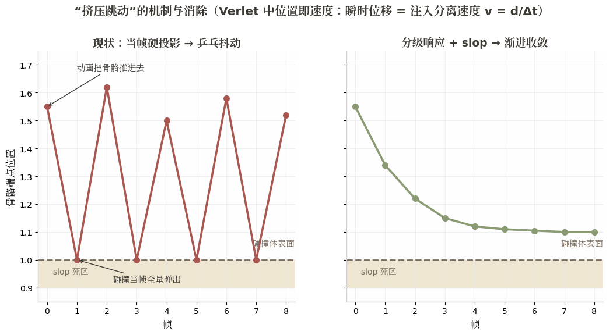
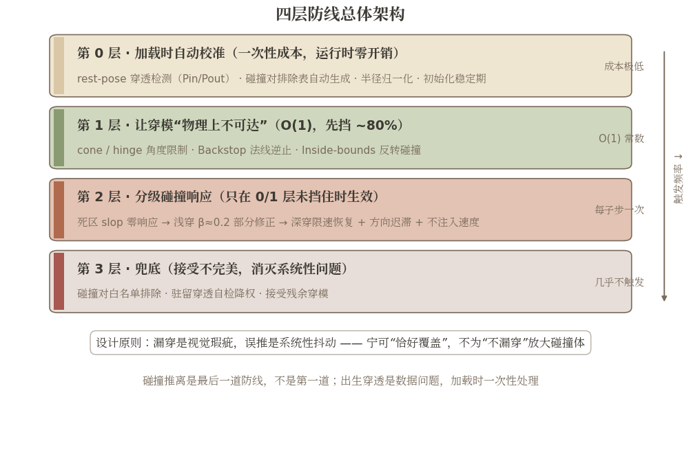
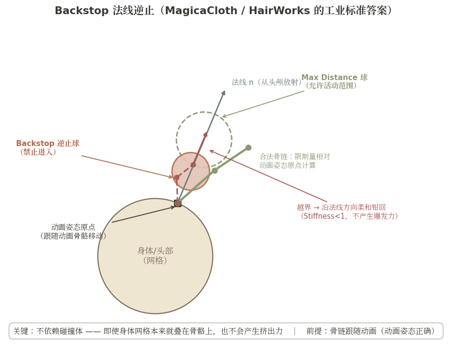
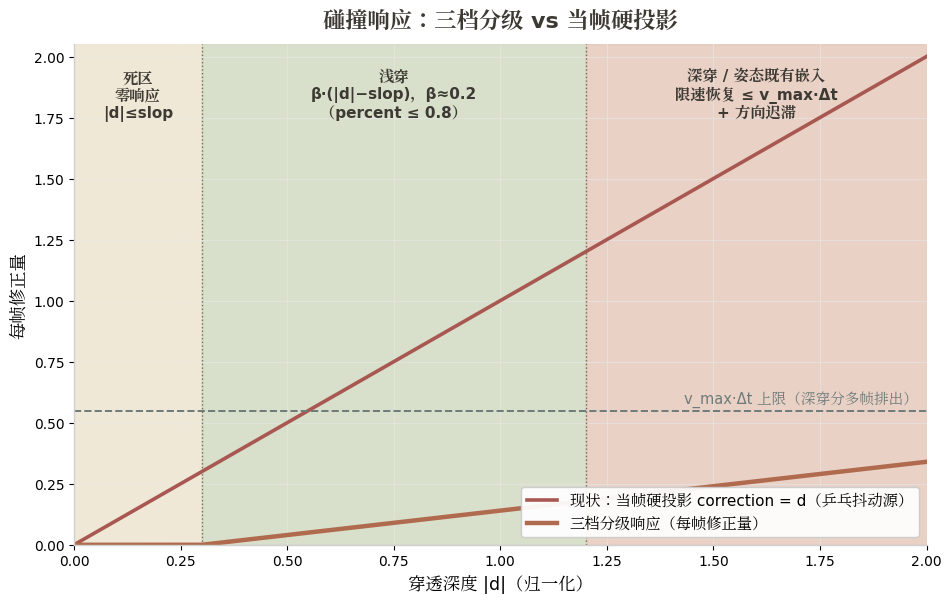
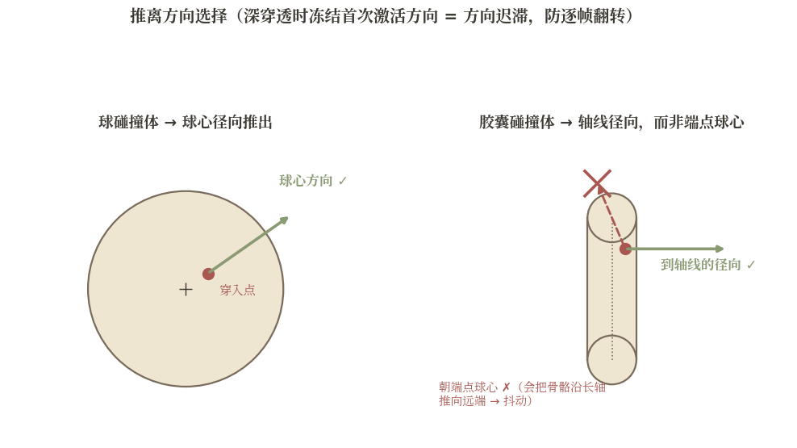
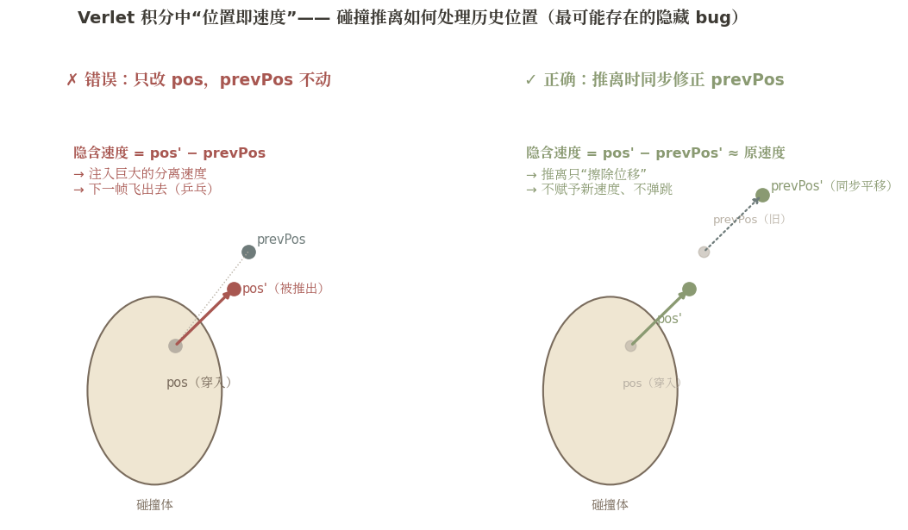
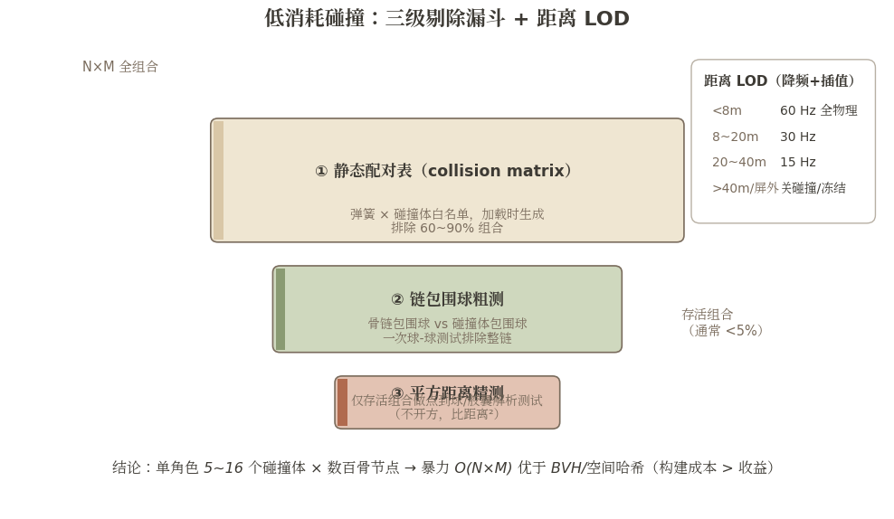

# VRM 弹簧骨骼防穿模技术解决方案
## —— 面向「车万女仆」附属模组的 Java 实现报告

> **目标读者**：已有 Verlet 弹簧骨骼实现（物理摆动自然）、穿模严重、且因"模型姿态本身已穿模"导致挤压抖动（jitter）的 TLM 附属模组开发者。
> **置信度约定**：文中结论分三级标注——【高置信】≥2 个独立来源一致；【经验值】单一来源/社区经验，数学上未证明；【估算】外推推算，未经实测。
> 引用格式 `[^dN-M^]` 表示维度 N 调研文件的第 M 号引用，完整 URL 见文末参考来源。

---

## 1. 问题重新界定：这不是碰撞检测弱，而是碰撞策略与初始化错

先说结论：**"姿态本身穿模 → 挤压跳动"用更强的碰撞检测或更狠的推离只会更糟**。三套独立体系（VRM 官方规范、MMD/VRChat 社区、物理引擎学界）给出了同构的机制分析：

**(a) 现有算法是"当帧硬投影"，这正是抖动的结构性来源。** VRM 1.0 规范的参考实现中，碰撞步一旦 `distance < 0` 就当帧把 tail 一次性推到碰撞体表面并重新约束骨长——无迭代、无松弛、无穿透深度概念[^d1-1^][^d1-3^]。在 Verlet 积分里"位置即速度"：一次瞬时位移修正会被下一帧的惯性项解释为分离速度，Small Steps 论文证明初始穿透会被转换成 `v = d/Δt` 的分离速度，**步长越小 popping 反而越严重**[^d3-5^]。于是形成乒乓循环：动画姿态把骨骼推进碰撞体 → 碰撞当帧全量推出 → 弹簧回位力下一帧又拉回去 → 再碰撞。Unity 社区对这种振荡有精确定义："objects at rest colliding on one frame, going out of collision, then colliding the next frame..."[^d3-3^]【高置信】

**(b) "姿态本身穿模"违反了碰撞系统的基本假设，运行时无解。** 普通碰撞系统假设初始状态无穿透（intersection-free state），响应任务只是"防止进入"。MMD 社区有实录：初始就互相重叠的碰撞刚体，一上物理演算就不停抖动（プルプル）；有模型作者"把头发刚体放大到极限也修不好，最后放弃（改小）"——**初始重叠的碰撞对，加大碰撞体只会把穿模变成常驻抖动**[^d6-668^][^d6-731^]。ADB（Automatic-DynamicBone）官方 Q&A 把"盆骨附近碰撞体过大挤压 skirt 一圈约束点"列为布料持续抖动的首要排查项，解法是调小碰撞体/允许嵌入，而不是加强响应[^d6-142^][^d2-142^]。学术侧（Shortest Path to Boundary, SIGGRAPH 2023）进一步指出：自相交状态下连"推出去的方向"都不再良定义，深穿透时最短边界路径可能在模型的另一侧[^d3-1^]【高置信】

**(c) 因此问题正解是"碰撞可达性"，不是"碰撞响应"。** VRChat 官方文档明确说 PhysBone 的 Limits（角度限制）"可以用于防穿模，**比碰撞更高效**"——让穿模姿态在物理上不可达，是零碰撞检测成本的防穿模手段[^d6-654^]。MagicaCloth 的 Backstop 不用任何碰撞体，靠限制顶点相对**动画姿态原点**沿法线反方向的侵入深度，就能防"咬进身体"，其官方性能负载表上 Backstop 是最低档（★1）[^d2-149^][^d2-188^]。MagicaCloth 官方项目实战帖的结论更直白："正式项目里关掉 self/mutual collision，只用 colliders + backstops"[^d8-27^]【高置信】

{width=15cm}

**碰撞推离应当是最后一道防线，而不是第一道；出生穿透（rest-pose 穿透）是数据问题，必须在加载时一次性处理，而不是运行时逐帧对抗。**

---

## 2. 总体解决架构：四层防线模型

```
┌─────────────────────────────────────────────────────────────┐
│ 第 0 层  加载时自动校准（一次性成本，运行时零开销）              │
│  · rest-pose 穿透检测（Pin/Pout 分类）                        │
│  · 自动生成碰撞对排除表 / 半径归一化（含缩放换算）               │
│  · 初始化稳定期（Stabilization Time）                          │
├─────────────────────────────────────────────────────────────┤
│ 第 1 层  让穿模"物理上不可达"（O(1)，先挡住 80%）               │
│  · cone / hinge 角度限制（相对父骨骼最大摆角）                  │
│  · Backstop 法线逆止（相对动画姿态原点的侵入限制）              │
│  · Inside-bounds 反转碰撞（把骨骼关在体积内）                  │
├─────────────────────────────────────────────────────────────┤
│ 第 2 层  分级碰撞响应（只在 0/1 层没挡住时生效）                │
│  · 死区：|d| ≤ slop        → 零响应                          │
│  · 浅穿：部分修正（β≈0.2，percent≤0.8）                      │
│  · 深穿：限速恢复（每帧修正量 ≤ max(v_max·Δt, maxCorrection)）│
│  · 方向稳定：球心/胶囊轴径向 + 深穿方向迟滞                    │
│  · Verlet 历史不注入速度 + 位置级摩擦                          │
├─────────────────────────────────────────────────────────────┤
│ 第 3 层  兜底（接受不完美，消灭系统性问题）                     │
│  · 碰撞对排除表（per-spring × per-collider 白名单）           │
│  · 驻留穿透自检 → 自动降权该碰撞对                            │
│  · 接受残余穿模：目标是收敛无抖动，不是 100% 无穿模            │
└─────────────────────────────────────────────────────────────┘
```

设计原则（交叉验证全部【高置信】）：**漏穿是视觉瑕疵，误推是系统性抖动**[^d6-17^][^d6-105^]。宁可让碰撞体恰好覆盖、rest pose 下任何骨骼都不落在碰撞体内部，也不要为了"不漏穿"而放大碰撞体。

{width=15.5cm}

---

## 3. 每层的技术细节

### 3.1 第 0 层：加载时自动校准管线

对 mod 场景（玩家自制模型姿态千奇百怪、手工调参不可扩展），这一步是整个方案里性价比最高的结构性改动。多个独立来源指向同一模式：MMD 社区实录、gpu-cloth-sim 的 SANITIZE pass（每帧模拟前先做一次穿透净化，"kills rest jitter"）、MagicaCloth2 的 Stabilization Time（官方释义即"避免一开始和碰撞体重叠后被猛烈弹开"）、Disney 的 rest-pose level set φ₀[^d2-189^][^land-27^][^d3-7^]【高置信】

**管线三步（模型加载/换装时执行一次）：**

1. **rest-pose 穿透检测（Pin/Pout 分类）**：把模型摆到绑定姿态（T-pose/A-pose 或模型自带的 rest），对每根弹簧骨骼关节 × 每个碰撞体计算穿透深度。输出三类数据：
   - `Pin 清单`：rest 姿态下已穿透的 (joint, collider) 对及其穿透量 d_rest；
   - `d_rest 基准表`：对穿透量小的对，**记录 d_rest 作为该对的合法基准**——运行时响应目标从"推到表面 (d=0)"放宽为"推回 d = d_rest"。这等价于把姿态自穿模显式建模为允许状态（rest-pose SDF 思想的零成本版）[^d3-7^]；
   - `排除表`：穿透量大（如 |d_rest| > 碰撞体半径的 50%，经验阈值）的对直接禁用——这是 MMD"头发-头恒非冲突"、three-vrm"头 collider 半径清零"的自动化[^d6-729^][^d6-17^]。

2. **碰撞半径归一化（缩放陷阱必须主动处理）**：UniVRM #673 的教训——碰撞体挂在缩放≠1 的骨骼上时，编辑器 Gizmo 显示正确但导出后碰撞体相对模型变大了整整 2 倍；官方立场是"不推荐 SpringBone 与缩放混用"[^d1-6^][^d1-11^]。three-vrm 社区的经验修复是运行时把 collider radius 乘以约 0.5【经验值，作者自述数学原因不确定】[^d1-11^]。对 MC 模组的落地规则：**碰撞体 radius、hitRadius、boneLength 必须统一定义在世界（或模型根）空间；实体缩放变化时同步换算所有半径**，否则会出现"视觉正常但碰撞体大一倍"的隐性顶起/挤压。

3. **初始化稳定期**：物理启用/重置后的前 N 个物理步（如 0.5 秒），碰撞修正权重从 0 渐变到 1，并把 Verlet 历史清零（`prevPos = pos`），消除"开局重叠被弹飞"[^d2-189^]。传送/大位移（骨骼根位移超过阈值）时同样处理——MagicaCloth2 v2.2 的 teleport 检测与 MikuMikuPhysics 的"高速拖动保护"是同一机制[^d2-159^][^d7-451^]。

**诊断开关（Insight 6）**：内置碰撞体线框 debug 渲染（对应 VSeeFace 反引号模式）和"所有碰撞体 radius 置 0"诊断法——若置 0 后头发恢复正常，即确认问题在碰撞体配置而非物理本身[^d1-11^][^d6-509^]。可视化调试比参数本身更重要。

### 3.2 第 1 层：防穿模优先于碰撞——让穿模不可达

三种机制按成本从低到高，全部 O(1)，不做任何碰撞检测：

**(a) cone / hinge 角度限制。** 限制每节骨骼相对父骨骼（或相对动画姿态方向）的最大摆角：前发不往后转就不会埋进脸，侧发不向内转就不会穿头[^d6-668^]。VRChat 社区实证：裙子把 Limit 从 Angle 改为 Hinge（只允许前后摆动）后"360° 乱动被压住，直接贡献防穿模"[^d6-647^]。实现只需一次四元数夹角判断 + 钳制，【高置信】"比 collider 快得多"[^d6-654^]。注意先用 C 曲线让根部硬、末端软（根部限得紧、裙摆放开），并警惕"限制与碰撞互相打架"——排查抖动时先放宽限制再调碰撞[^d6-657^]。

**(b) Backstop 法线逆止。** 这是处理"骨骼嵌入身体"的工业标准答案（HairWorks、MagicaCloth2、正式项目实战一致）[^d8-20^][^d2-149^][^d8-27^]【高置信】。原理：

- 为每条骨链定义一个**动画姿态原点**和**法线**（头发的实用近似：从头颅中心放射；裙摆：从髋部中心放射——对应 MC2 的 Normal Alignment = Transform，只存一份 proxy 法线数组，不改原始模型）[^d2-122^][^d2-149^]；
- 骨骼只允许在"原点 + Max Distance 球"内运动（第一层）；且不允许越过"法线反方向 Backstop Distance 处、半径 Backstop Radius 的逆止球"（第二层）；
- **关键：限制量相对动画姿态原点计算，而非相对碰撞体绝对位置**。腿怎么动、动画姿态原点就怎么动，Backstop 跟着走——即使身体网格本来就叠在骨骼上，也不会产生爆发式挤出力。前发案例：不用任何 collider 就能防刘海进头[^d2-149^]；
- Stiffness < 1 让回弹柔和。注意前提：骨链必须跟随动画（动画姿态正确）——若裙摆没蒙皮到腿、动画时腿直接穿出裙子，Backstop 失效，此时只能靠第 2 层碰撞体[^d2-149^]。

{width=14.5cm}

**(c) Inside-bounds 反转碰撞。** 把骨骼**约束在碰撞体内部**而不是排斥在外：VRM 1.0 扩展规范 `VRMC_springBone_extended_collider` 提供 inside-sphere / inside-capsule / plane 三种"反向约束"碰撞体，附完整伪代码可直接移植[^d1-2^][^d3-18^]。VRChat 社区经验："小范围移动用外碰撞，大范围移动用内碰撞"；背部放 plane collider 一次性解决长发穿躯干[^d6-654^][^d6-656^]。其价值在于**推离方向由建模者显式指定，从规范层面消除方向歧义**——对"长发贴背、裙内腿"这类已知嵌入区域，inside 语义比多个外推 collider 更稳。

### 3.3 第 2 层：碰撞响应防抖动——三档分级响应

这是需要动你现有 Verlet 代码的部分，但**只需改碰撞投影那一小段**。Unity/Jolt/Box2D/Small Steps 四套独立体系给出几乎相同的参数模式（β≈0.2、percent≤0.8、slop≈半径 20~50%）【高置信】[^d4-11^][^d4-13^][^d4-14^][^d3-5^]。

**穿透深度 d（负值）分三档：**

| 档位 | 条件 | 响应 |
|---|---|---|
| 死区 | `|d| ≤ slop` | **零响应**。允许微小穿透，换取静止不抖（Box2D `b2_linearSlop = 0.005m`；Unity Skin Width >0.01 且 >半径 10%）[^d4-11^][^land-37^] |
| 浅穿 | `slop < |d| ≤ d_deep` | **部分修正**：每帧只修正 `β × (|d| − slop)`，β≈0.2，percent 上限 0.8，绝不用 1.0（1.0 会引入新重叠、互相弹跳）[^d4-14^] |
| 深穿（含姿态既有嵌入） | `|d| > d_deep` | **限速恢复**：每帧修正量 ≤ `min(v_max·Δt, maxCorrection)`，分多帧排出；**绝不一次性投影**；冻结首次激活的推离方向（方向迟滞）[^d3-5^][^d4-2^] |

{width=14.5cm}

**推离方向选择（交叉验证已裁决）**：球 → 球心方向；胶囊 → **到轴线的径向方向**（不是到端点球心——长条碰撞体用球心方向会把骨骼推向远端，有反例）[^d3-2^][^d3-16^]。深穿透时缓存激活时刻的方向沿用，直到降到浅层再切回实时径向（方向迟滞），防方向在边界附近逐帧翻转。**绝不使用渲染网格的最近表面法线**——自相交时该方向病态[^d3-1^]。

{width=15cm}

**Verlet 历史不注入速度（Insight 5，最可能存在的隐藏 bug）**：碰撞推离若直接改当前帧位置而 prevTail 不动，等于注入了分离速度。现代做法二选一：① 推离时**同步（或按比例）修正 prevTail**；② 完全不改 prevTail，把投影视为"擦除位移"而非"赋予速度"。检查你的碰撞推离代码是否污染了 prevPos/速度缓存，是消除抖动的零成本手术点[^d3-2^][^d4-2^][^land-27^]。

{width=15cm}

**位置级摩擦（Macklin 2014）**：对推离后的切向位移做修正——静摩擦阈值 `μ_s × d`，超过则按 `min(μ_k·d/|Δx⊥|, 1)` 缩放，μ_s, μ_k ≈ 0.2~0.6。直接针对"发丝从 collider 上滑脱穿模"[^d4-8^][^d4-15^]。

**多碰撞体合并修正**：VRM 规范实现对每个 collider 投影后都重做骨长约束，多个 collider 连环推出时后处理的会赢、可能把 tail 又推回前一个碰撞体内——这是"被夹在中间时跳动"的结构性原因[^d1-1^]。应**合并所有生效 collider 的修正向量后统一做一次骨长约束**，并限制每帧参与修正的 collider 数[^d3-2^]。

**Java 风格伪代码**（面向已有 Verlet 实现，只展示碰撞部分的改造）：

```java
// ===== 加载时（第 0 层产物） =====
// pinBaseline[joint][collider] = d_rest （rest 姿态穿透基准，无穿透时为 0）
// excluded[joint][collider]    = true 表示该碰撞对已禁用

// ===== 每物理子步，对每个 joint（父→子序） =====
float dt = FIXED_DT / SUBSTEPS;            // 固定步长，SUBSTEPS=2..4，delta clamp ≤ 50ms

Vector3f correction = scratch1.set(0, 0, 0);   // 合并修正向量，零分配
for (Collider col : joint.colliderSet) {        // 白名单配对表（第 0 层生成）
    if (excluded[joint.id][col.id]) continue;
    // 粗测：平方距离预剔除，几乎免费
    float distSq = joint.tail.distanceSquared(col.closestPoint(joint.tail, scratch2));
    if (distSq > col.cullRadiusSq) continue;

    // 精确：点到球/胶囊轴线最近点，d<0 为穿透（胶囊必须做真正的 point-segment 投影）
    float d = joint.tail.distance(scratch2) - col.radius - joint.hitRadius;

    float slop     = SLOP_FACTOR * joint.hitRadius;      // 死区 = 0.2~0.5 × hitRadius
    float baseline = pinBaseline[joint.id][col.id];      // rest 穿透基准（第 0 层记录）
    float pen      = -(d - baseline);                    // 超出基准的穿透量，>0 需修正
    if (pen <= slop) continue;                           // 死区：零响应

    // 推离方向：球=球心方向；胶囊=轴线径向。深穿时冻结首次激活方向（迟滞）
    Vector3f dir = (pen > DEEP_THRESHOLD && joint.frozenDir[col.id] != null)
                 ? joint.frozenDir[col.id]               // 方向迟滞
                 : scratch3.set(joint.tail).sub(scratch2).normalize();

    float corr;
    if (pen <= DEEP_THRESHOLD) {
        corr = BETA * (pen - slop);                      // 浅穿：部分修正 β≈0.2
    } else {
        corr = Math.min(V_MAX * dt, MAX_CORRECTION);     // 深穿：限速恢复
        if (joint.frozenDir[col.id] == null)
            joint.frozenDir[col.id] = new Vector3f(dir); // 冻结激活方向
    }
    correction.fma(corr, dir);                           // 累加，统一投影
}
// 统一修正 + 单次骨长约束（避免多 collider 连环投影互相打架）
joint.tail.add(correction);
projectToBoneLength(joint);
// 关键：Verlet 历史同步（不注入速度）。ratio=1 完全擦除位移；<1 保留部分反弹
joint.prevTail.fma(correction.length() * PREV_RATIO, scratch4.set(correction).normalize());
// 位置级摩擦：衰减切向位移，防滑脱与能量注入
applyPositionalFriction(joint, correction, MU_S, MU_K);
// 子步末 / 帧末：静止休眠（位移 < ε 冻结 prev=pos，消除贴面微振）
```

**推荐参数表**（综合 dim04 §5，标注置信度）：

| 参数 | 建议值 | 置信度 / 来源 |
|---|---|---|
| substeps（每帧子步数） | **2–4**，每子步 1 次约束迭代（优于 1 步 × N 迭代，误差低约两个数量级） | 【高置信】[^d4-2^] |
| 固定步长 | 60Hz 物理 tick；渲染 dt 一律 clamp ≤ 50ms；accumulator 上限 100~500ms 防 spiral of death | 【高置信】[^d5-23^][^d6-3^] |
| slop | `0.2–0.5 × hitRadius`（Box2D 等效尺度 5mm 级） | 【高置信】[^d4-11^][^d4-12^] |
| β（Baumgarte 修正比例） | **0.2**；>1 会 overshoot，percent 上限 0.8，绝不用 1.0 | 【高置信】[^d4-11^][^d4-14^] |
| maxCorrection（每帧最大修正） | `≤ max(v_max·Δt, 0.1–0.3 × r_collider)`；Box2D 参考值 0.2m 按模型尺度缩放 | 【高置信】[^d4-11^][^d4-2^] |
| v_max（去穿透速度上限） | 场景最大特征速度的 0.5–2 倍 | 【高置信/公式】[^d4-2^] |
| DEEP_THRESHOLD | 经验起点：`0.5 × r_collider`，配合第 0 层 d_rest 基准 | 【经验值】 |
| 摩擦 μ_s, μ_k | 0.2–0.6；"贴住 collider 的头发"提高静摩擦阈值 | 【高置信/经验区间】[^d4-8^][^d4-15^] |
| 阻尼 | Verlet 隐式阻尼系数 0.98–0.999 | 【经验区间】[^d4-1^] |
| 静止休眠阈值 ε | ≈ 0.1 × hitRadius，位移 < ε 冻结位置 | 【经验区间】[^d4-8^] |
| 约束求解顺序 | Gauss-Seidel，根→末端逐链；多链间顺序可交错防系统偏置 | 【高置信】[^d4-1^][^d4-19^] |
| 防链拉伸 | 每链一个 LRA 球（O(1)/节点），或预算极端紧张时 FTL 单遍 | 【高置信】[^d4-19^][^d4-22^] |
| 防抖三件套（官方机制） | `center` 空间（以模型根为惯性参考系，移动/传送不暴甩）+ dragForce 阻尼 + deltaTime 钳制 | 【高置信】[^d1-12^][^d1-11^] |

### 3.4 第 3 层：兜底——接受不完美

- **碰撞对白名单制**：学 PhysBone/VRM 的注册制——每条骨链只与显式注册的 collider 交互，不注册即永不碰撞[^d6-653^][^d1-5^]。第 0 层已自动生成初始排除表，这里保留运行时 per-pair 开关（等价 `Physics.IgnoreCollision`）[^d6-709^]。MMD 惯例直接照抄：手臂-上半身、头发-头（发根必然埋进头）恒为非冲突[^d6-729^]。
- **驻留穿透自检**：若某骨骼连续多帧被同一碰撞体挤出（驻留穿透），自动降低对该碰撞体的响应权重并记入 debug 日志——ADB Q&A 的经验：碰撞体挤压是抖动首因，修碰撞体而不是修响应[^d6-142^]。
- **接受残余穿模**：社区共识——碰撞是"推回去"级别的宽松机制，极端姿态必穿；**可以接受偶发穿模，不能接受持续抖动**。商用 VRChat 服装用"貫通対策シェイプキー"（直接删掉被遮住、注定会穿的身体网格）从几何层面消除穿模，并坦承极端姿势仍会穿是接受的代价[^d6-105^][^d6-651^]。你的目标是收敛无抖动，不是 100% 无穿模。

---

## 4. 低消耗工程实现

### 4.1 碰撞体设计准则【高置信】

- **只用球 + 胶囊**。Unity 官方性能排序：Sphere > Capsule > Box > Convex Mesh > Non-convex Mesh；OBB 单次 SAT 测试比球/AABB 贵约 10 倍，其紧致性优势在"点 vs 少量简单体"场景完全用不上[^d5-1^][^d5-5^]。胶囊天然贴合四肢/躯干，点-线段投影是闭式解、无分支、易内联。**一根 capsule 优于多颗 sphere 串联**（MagicaCloth 官方明确更快）[^d2-161^]。VRM 规范只有球/胶囊正是这个工程结论[^d5-4^]。
- **数量：每角色 5~16 个**。业界锚点：VRChat 硬限 8 个碰撞体、Unity demoteam hair 上限 8、TressFX UE4 移植最多 10 个胶囊[^d5-9^][^d5-10^][^d5-11^]。典型布置（可直接抄 VRoid/UniVRM 作业）：头 1 球、胸/上躯干 1~2 胶囊、髋 1 胶囊、两大腿各 1 胶囊（裙摆用）、双手各 1 小球（按需）；头发链只注册头/胸/手，裙摆链只注册髋/腿[^d1-24^][^d1-25^]。成本线性：M 从 8 涨到 32 = 碰撞成本翻 4 倍。
- **不做自碰撞/丝间碰撞**。MagicaCloth 负载表：Self Collision ★×10（最高），官方建议只在多核桌面 PC 启用；正式项目实战"关 self/mutual，只用 colliders + backstops"[^d5-20^][^d8-27^]。裙摆的视觉自碰撞用第 1 层手段掩盖：裙骨链间加横向 distance constraint + 每链最小张角约束（O(链数)，参考 UE self-collision layers 思想）[^d8-21^][^d8-28^]。

### 4.2 三级剔除漏斗

1. **配对表（collision matrix）**：按骨架拓扑距离静态预生成"骨链 → 碰撞体子集"映射（链根与碰撞体挂载骨骼在骨架树上距离 ≤ K 才入表），把每链平均碰撞体数从 10~16 压到 3~6[^d5-17^]；
2. **链包围球粗测**：每条链维护静态包围球（链根 + 最大链长为半径），与膨胀后的碰撞体做球-球测试，不相交整条链跳过[^d5-12^]；
3. **逐节点平方距离预剔除**：`dist² > (r_node + r_collider + margin)²` 先比较（避免 sqrt），通过才进精确投影[^d5-19^]。

单角色小碰撞集（N×M ≈ 数千次纯标量测试）下**暴力 O(N×M) 优于 BVH/空间哈希**——ipc-sim 文档明确 brute force 适合 small bodies，哈希表/BVH 的构建维护成本超收益[^d5-13^][^d5-14^]【高置信】。

### 4.3 LOD 降频 + 渲染插值

- **三级距离 LOD**（按屏幕投影尺寸而非纯距离调整阈值）[^d5-21^][^d5-22^]：近 <10m 全频（60Hz）+ 完整碰撞；中 10~30m 降频 30Hz；远 >30m 15Hz 且**关闭碰撞只保留弹簧摆动**（穿模在远处不可见）；屏幕外/被 frustum culling 完全冻结。降频与耗时是线性关系[^d5-20^]。
- **降频 ≠ 卡顿**：固定步长 + accumulator（物理 60Hz tick），渲染帧用前后两状态 lerp 插值——"Fix Your Timestep!" 标准架构，MagicaCloth 同样内置跳步插值[^d5-23^][^d5-20^]。冻结恢复时 reset 到当前姿态静止形态再渐进启用（配合 3.1 的稳定期），防镜头切换/传送后弹簧爆炸[^d5-25^]。
- **MC 落点**：物理在渲染侧以真实帧 deltaTime 步进（固定子步拆分），不要按 20 TPS 逻辑 tick 驱动再指望 partialTick 插值——60 FPS 下头发会只剩 20Hz 跳动[^d7-437^]。挂点：TLM 1.20+ 的 SimpleBedrockModel 骨骼树（`BedrockPart`），在动画求值之后、立方体提交之前追加物理旋转——**先让动画定姿态，物理只做姿态之上的二阶摆动**，与 JS/Gecko 动画串联而非竞争[^d7-485^]。

{width=15cm}

### 4.4 Java 并行与零分配

- **并行粒度 = 按角色**：几十只女仆 = 几十个天然独立任务包。ForkJoinPool（线程数 = `availableProcessors() - 2`，给渲染/网络留核），worker 只做纯数学（弹簧积分、碰撞推挤），姿态用**双缓冲**（worker 写 nextPose[]，主线程帧末 swap）；绝不在线程内触碰 MC 世界/实体对象[^d5-35^][^d7-573^]。先保证单线程正确性再上多线程（ADB 也提示多线程影响收敛判定）[^d2-142^]。
- **稳态零分配**：热路径绝不 new——JOML 原地运算（`v.add(a)` 修改自身，MC 1.18+ 原版已内置 JOML）+ SoA `float[]` 状态数组 + ThreadLocal scratch 实例[^d7-440^][^d5-36^]。MC 客户端 GC 压力本已大，物理系统零分配是避免 GC 毛刺与物理卡顿互相放大的前提。状态对象随实体创建/销毁即可，**无需池化**；需要复用的是跨实体共享的临时碰撞结果缓冲[^d7-576^]。
- **收益排序**：LOD（3~10×）> 配对表/粗测（2~4×）> 多线程（≈核数×）> 零分配（消除尖峰）> SIMD（1.5~3×，Java 21+ 可用 Vector API，最后做）[^d5-41^]。
- **不要走的路**：不要为几十根弹簧骨骼引入 Bullet/PhysX/Rapier JNI（Rayon 实践证明纯 Java JBullet 过时弃用、MC-MMD-rust 的 native 路线价值在大规模刚体不在骨骼摆动）[^d7-443^][^d7-448^]；GPU compute 也不划算（万级节点低于 GPU 甜点区，回读延迟 + 低端核显兼容性是硬伤）[^d5-34^]。

### 4.5 性能预算【估算，未经实测】

设每只女仆 300 骨节点 × 配对后平均 4 个碰撞体 = 1,200 次点-胶囊测试/帧，点-胶囊测试按 ~50ns 估，单角色碰撞 ≈ 60µs，弹簧积分同量级，**单角色全频物理约 0.1~0.2ms（单线程）**。30 只全频 ≈ 3~6ms 不可接受 → 叠加 LOD（近 5 只全频、中 15 只 30Hz、远 10 只 15Hz 关碰撞）≈ 1.0ms 单线程，再 4 线程并行 ≈ **0.3ms/帧**[^d5-29^]。交叉印证：DynamicBone 原版多线程 30 人 6ms，Job+Burst 重写后同场景 0.05ms[^d5-29^]；VRMMetalKit 的 XPBD SpringBone 设计目标"50–100 bones @60FPS"[^d8-30^]。落在 MC 客户端 50ms tick 预算的可接受范围。

**结论：性能预算下技术栈已收敛为唯一路线——球/胶囊解析碰撞体 + Backstop + substep 内 PBD/XPBD 投影 + LOD。学术前沿（网格自碰撞最优也要 1.7~2.1ms/帧、IPC 秒级、神经方法需 GPU）全部不可移植，无需担心"错过更高级的技术"——工程重点应放在参数与初始化策略上，而非算法选型。**[^d8-4^][^d8-12^]【高置信】

---

## 5. 实施路线图（按性价比排序）

| 阶段 | 改动 | 预期效果 | 风险 |
|---|---|---|---|
| **P0（最小改动最大收益）** | 只改碰撞投影那一小段：slop 死区 + β=0.2 部分修正 + 每帧 maxCorrection 限速 + 多 collider 合并修正后统一骨长约束。**检查 prevPos 是否被碰撞推离污染**（Insight 5 零成本手术点） | 消除绝大部分静止/贴面抖动；深穿透变成数帧渐进恢复（视觉可接受） | 极低；残留轻微穿模属预期 |
| **P1** | 加载时 rest-pose 穿透检测 → 自动生成排除表 + d_rest 基准表 + 半径缩放归一化；初始化稳定期 + 传送 reset | "姿态本身穿模"的挤压跳动从源头消失；玩家自制模型免手工调参 | 低；rest 检测需在模型加载管线加挂点 |
| **P2** | 第 1 层：裙骨 Hinge 限制 + 头发 cone 限制；头发/裙摆 Backstop（头颅/髋部放射法线） | 80% 穿模在碰撞检测之前被挡住；碰撞体数量可进一步缩减 | 中；限制太紧会与碰撞打架（先宽后紧）；Backstop 法线对怪异发型需调参 |
| **P3** | 碰撞体整改：≤16 个球/胶囊、白名单注册制、配对表 + 三级剔除漏斗 | 单角色物理成本压到 ~0.1ms 量级 | 低；纯工程 |
| **P4** | 固定步长 + accumulator + 三级距离 LOD + 渲染插值；delta clamp ≤50ms | 30 只同屏 ≈ 1ms 单线程；掉帧/传送不炸 | 中；LOD 切换边界的突变需 reset 处理 |
| **P5** | substeps 2~4 + 位置级摩擦 + 静止休眠；（可选）LRA 球防链拉伸 | 高速甩动下不隧道、不爆；发丝防滑脱 | 低；成本线性于 substep 数 |
| **P6** | ForkJoinPool 按角色并行 + 双缓冲；稳态零分配审计 | ≈0.3ms/帧 @30 女仆 | 中；必须先单线程正确；线程内禁碰 MC 对象 |
| **P7（可选）** | inside-sphere/plane collider（长发贴背区域）；驻留穿透自检降权；debug 可视化线框渲染 | 疑难区域定向修复；玩家自助排查 | 低 |

原则：P0~P1 解决 80% 的痛点，每步独立可回滚；P4 之后再谈并行。**不要**先上多线程/SIMD/JNI——那是把错误的东西算得更快。

---

## 6. 附录

### 附录 A：抖动排查清单（16 项，源自 dim06，按常见度排序）

**碰撞配置类**
1. 骨骼初始就在碰撞体内（姿态本身穿模）→ 排除该碰撞对 / 缩小或挪开 collider / 放宽角度限制[^d6-668^]
2. 碰撞体范围内有受约束的骨骼（典型：骨盆 collider 过大挤压裙子一圈）→ 调小 collider[^d6-142^]
3. 碰撞体过大/位置不对（头发悬空、裙子鼓起、模型缩小时爆炸）→ 半径砍半起步排查；运行时缩放必须同步缩 collider[^d6-17^]
4. 碰撞体与角度限制互相打架 → 先放宽限制再调碰撞[^d6-657^]
5. DragForce 太大压过 collider 推挤 / 重力过大 → 降低阻尼与重力系数[^d6-105^][^d6-738^]

**积分与步长类**
6. deltaTime 错误（毫秒当秒、掉帧突增；three-vrm 社区 ~90% 抖动案例根因）→ clamp ≤ 0.05s 或改固定步长[^d6-3^]
7. 迭代/子步不足（高速运动穿透+抖动）→ 加 substep 优于加迭代[^d6-142^]
8. 刚度太高 + 步长太大 → 软化 stiffness 或减步长；阻尼不足会持续振荡[^d6-686^]
9. 物理挂在变步长回调 / 用直接改位置驱动 → 固定步长模拟[^d6-695^]

**系统冲突类**
10. 两套物理共存控制同一批骨骼 → 全量转换/删除其一[^d6-665^]
11. 动画与物理抢同一骨骼（含动画压缩引入的抖动）→ 明确动画→物理的串联顺序[^d6-659^]
12. 不合理的约束参数（负数/极端值/对头发用 shear）→ 回归默认参数逐项排查[^d6-142^]
13. 重力与悬挂约束拔河（MMD 经典）→ 位置钉死骨骼、角度随物理[^d6-730^]
14. 追踪输入噪声（VTuber 侧：光照/摄像头/smoothing）→ 输入端先滤波[^d6-509^]

**隐藏状态类**
15. 不可见模型仍在参与碰撞（只隐藏了网格）→ 隐藏时同步停物理[^d6-677^]
16. 客户端安全设置/评级隐藏物理表现（VRChat 特有，类比 MC：检查渲染距离与实体追踪设置）[^d6-663^]

### 附录 B：关键参数速查表

| 参数 | 值 | 置信度 |
|---|---|---|
| slop | 0.2–0.5 × hitRadius（~5mm 量级） | 高置信 |
| β / percent | 0.2（上限 0.8，禁用 1.0） | 高置信 |
| maxCorrection | ≤ max(v_max·Δt, 0.1–0.3 × r_collider) | 高置信 |
| v_max | 场景特征速度的 0.5–2 倍 | 高置信/公式 |
| substeps | 2–4 × 1 iter（固定 60Hz，delta clamp ≤50ms） | 高置信 |
| 摩擦 μ_s / μ_k | 0.2–0.6 | 高置信/经验区间 |
| 阻尼系数 | 0.98–0.999 | 经验区间 |
| 休眠阈值 ε | ≈ 0.1 × hitRadius | 经验区间 |
| 碰撞体 | 球+胶囊，每角色 5–16 个，白名单注册 | 高置信 |
| 半径缩放经验系数 | ×0.5（VRoid 导出模型） | 经验值（单一来源，慎用） |
| 稳定期时长 | ~0.5s，权重 0→1 渐变 + prevPos 清零 | 经验值 |
| 单角色预算 | ~0.1–0.2ms（全频单线程）；30 女仆 + LOD + 4 线程 ≈ 0.3ms/帧 | 估算（未实测） |

### 附录 C：参考来源

按维度文件编号汇总（`[^dN-M^]` = 维度 N 文件第 M 号引用）：

**核心规范与源码**
- [^d1-1^][^d3-2^][^d6-80^] VRMC_springBone-1.0 规范（Verlet 算法与碰撞伪代码）: https://github.com/vrm-c/vrm-specification/blob/master/specification/VRMC_springBone-1.0/README.md
- [^d1-2^][^d3-18^] VRMC_springBone_extended_collider（inside/plane collider）: https://github.com/vrm-c/vrm-specification/blob/master/specification/VRMC_springBone_extended_collider-1.0/README.md
- [^d1-6^] UniVRM Issue #673（碰撞体缩放不一致）: https://github.com/vrm-c/UniVRM/issues/673
- [^d1-11^][^d5-25^][^d6-17^] n.e.k.o vrm-springbone-physics skill（碰撞体过大实证、0.5 系数、delta 钳制）: https://lobehub.com/skills/project-n-e-k-o-n.e.k.o-vrm-physics
- [^d1-18^] VRMMetalKit ADR-004（XPBD for SpringBone）: https://github.com/arkavo-org/VRMMetalKit/blob/main/docs/adr/004-xpbd-springbone-physics.md

**防穿模机制（插件/工业）**
- [^d2-149^] MagicaCloth2 官方《Backstop》: https://magicasoft.jp/en/mc2_backstop_setup/
- [^d2-152^] MagicaCloth2 官方《Setting Collision Detection》: https://magicasoft.jp/en/mc2_collision_setup/
- [^d2-188^] MagicaCloth2 官方《パフォーマンス》: https://magicasoft.jp/mc2_performance/
- [^d2-189^] MagicaCloth2 参数笔记（Stabilization Time 释义）: http://www.skyshin34.com/magicacloth2/
- [^d2-142^][^d6-142^] Automatic-DynamicBone Wiki Q&A（抖动首查碰撞体挤压）: https://github.com/OneYoungMean/Automatic-DynamicBone/wiki/Q&A
- [^d8-20^] NVIDIA HairWorks 官方文档（Backstop / Collision Capsules）: https://docs.nvidia.com/gameworks/content/artisttools/hairworks/HairWorks_viewerReference_hairTab.html
- [^d8-27^] MagicaCloth2 实战帖（正式项目只用 colliders + backstops）: https://discussions.unity.com/t/released-magicacloth2-hybrid-cloth-simulation/908244?page=43

**数学与稳定性**
- [^d4-1^] Müller et al., Position Based Dynamics, VRIPHYS 2006: https://matthias-research.github.io/pages/publications/posBasedDyn.pdf
- [^d4-2^][^d3-5^] Macklin et al., Small Steps in Physics Simulation, SCA 2019（substepping、v_max 公式）: https://mmacklin.com/smallsteps.pdf
- [^d4-8^] Macklin et al., Unified Particle Physics, TOG 2014（pre-stabilization、位置级摩擦、sleeping）
- [^d4-11^] Box2D b2Settings（slop/baumgarte/maxCorrection 数值）: https://jesse.tg/Box2D-Docs/b2_settings_8h.html
- [^d4-13^] Erin Catto, Solver2D（TGS、relaxation 双解）: https://box2d.org/posts/2024/02/solver2d/
- [^d4-14^] Erik Onarheim, Understanding Collision Constraint Solvers（pseudo-impulse、percent=0.2）: https://erikonarheim.com/posts/understanding-collision-constraint-solvers/
- [^d4-19^] Kim et al., Long Range Attachments, SCA 2012: https://matthias-research.github.io/pages/publications/sca2012cloth.pdf
- [^d3-1^] Chen, Diaz, Yuksel, Shortest Path to Boundary, SIGGRAPH 2023: https://arxiv.org/pdf/2305.09778
- [^d3-7^] McAdams et al.（Disney rest-pose level set）: https://pages.cs.wisc.edu/~sifakis/papers/elasticity_skinning.pdf

**社区实践**
- [^d6-654^] yexca'Docs PhysBones（Limits 比碰撞快、Inside Bounds）: https://vrchat.yexca.net/en/dynamics/physbones/
- [^d6-647^] laugh-gadget PhysBone 防穿设置（Hinge、C 曲线、骨数）: https://laugh-gadget.com/2026/01/26/vrchat-physbones-setting/
- [^d6-729^] nnwarks MMD 抖动对策（プルプル三因、非冲突组）: https://nnwarks.com/mmd_topic4/
- [^d6-731^] modelingstudymeeting（刚体放到极限大→放弃）: https://modelingstudymeeting.hatenablog.com/entry/2022/06/27/000241
- [^d6-668^] Yahoo!知恵袋 PMX 剛体（初始重叠→抖动）: https://detail.chiebukuro.yahoo.co.jp/qa/question_detail/q12272001717
- [^d6-651^] BOOTH 貫通対策シェイプキー（接受极端姿势穿模）: https://booth.pm/ja/items/7285807
- [^land-27^] alien-life/gpu-cloth-sim（SANITIZE pass、摩擦阻尼杀速度注入）: https://github.com/alien-life/gpu-cloth-sim
- [^land-37^] Unity CharacterController 文档（Skin Width >0.01 且 >半径 10%）: https://docs.unity3d.com/352/Documentation/Components/class-CharacterController.html

**性能与 MC 落地**
- [^d5-1^] Unity Manual Collider types and performance: https://docs.unity3d.com/2022.3/Documentation/Manual/physics-optimization-cpu-collider-types.html
- [^d5-9^][^d5-10^][^d5-11^] VRChat 8 collider 限制 / Unity demoteam hair #27 / UE4_TressFX 10 capsules
- [^d5-13^] ipc-sim/rigid-ipc 碰撞检测文档（brute force 适合 small bodies）: https://deepwiki.com/ipc-sim/rigid-ipc/2.2-collision-detection-system
- [^d5-23^] Fixed vs Variable Timestep（accumulator、spiral of death）: https://www.socratopia.app/library/math-for-game-devs-en/chapter-27
- [^d5-29^] DynamicBone Job+Burst 重写（30 人 6ms→0.05ms）: https://www.cnblogs.com/jietian331/p/17154522.html
- [^d5-36^] JOML（零分配设计）: https://github.com/JOML-CI/JOML
- [^d7-485^][^d7-529^] TLM BedrockModel / SimpleBedrockModel: https://github.com/TartaricAcid/SimpleBedrockModel
- [^d7-448^] MC-MMD-rust（JNI 路线先例）: https://github.com/shiroha-233/MC-MMD-rust
- [^d7-443^] Rayon（JBullet→LibBulletJME 教训）: https://red.mnstate.edu/sac/2021/cbac/4/
- [^d7-451^] MikuMikuPhysics（120Hz×8 substeps、高速拖动保护）: https://github.com/chris0214/MikuMikuPhysics
- [^d8-4^] Abu Rumman et al., MIG 2015（网格级自碰撞 1.7–2.1ms）: https://dl.acm.org/doi/10.1145/2822013.2822034

---

*本报告基于 8 个维度调研文件 + 主代理地形扫描 + 交叉验证（置信度分级）+ 6 条跨维度洞察撰写，未做任何额外检索。*
